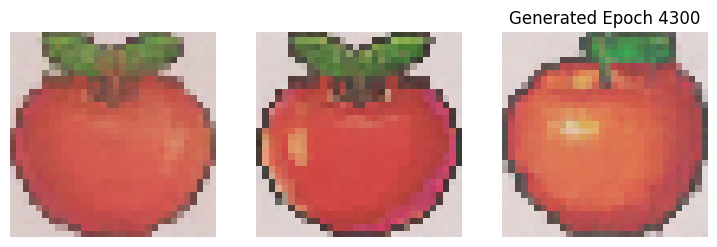

# 🍎 Apple Pixel Art Generator (Diffusion Model)


An implementation of a *Generative AI* using *Diffusion Models* to create apple pixel art from scratch (random noise).

## 📸 Generated Results
These are the results generated by the model after *5000 Epochs* of training:

<p align="center">
  
  <br>
  <i>"Purely AI-generated, not hand-drawn."</i>
</p>

---

## 🛠️ Architecture & Features
This project implements advanced deep learning concepts, including:
* *U-Net Backbone:* The core engine for the iterative denoising process.
* *Residual Blocks:* Enhancing gradient flow for deeper feature learning.
* *Attention Mechanism:* Helping the model focus on global structures (apple shape and symmetry).
* *Linear Noise Schedule:* Ensuring stable image degradation and reconstruction.

## 📂 Project Structure
```text
.
├── src/                # Main source code (Notebook/Python scripts)
├── weights/            # Pre-trained model weights (.h5)
├── results/            # Sample images generated by the model
├── requirements.txt    # List of necessary libraries
└── README.md           # Project documentation

GETTING STARTED
1.Clone this repository or download the files

2.Install the required dependencies:

                ```pip install -r requirements.txt```

3.Open the notebook in src/diffusion.ipynb

4.Load the trained weights from the weights/folder

5.Run the simple_images() function to generate your own apples!

Author: Alvaro
Status: Portfolio Project - 10th Grade Multimedia / Informatics Student.
"Exploring the future of AI, one pixel at a time."
